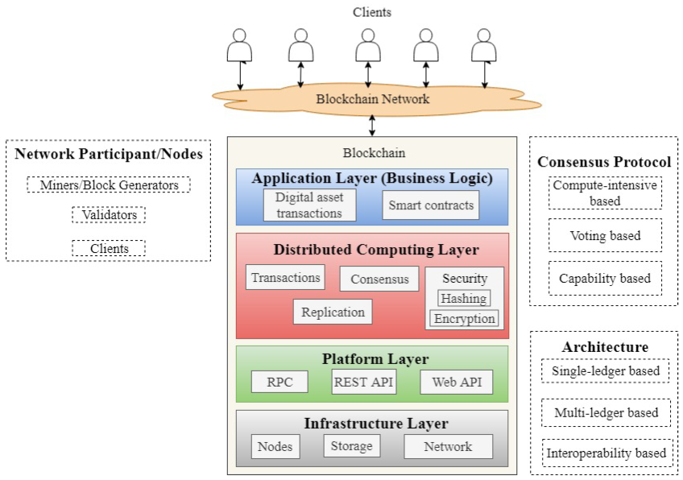
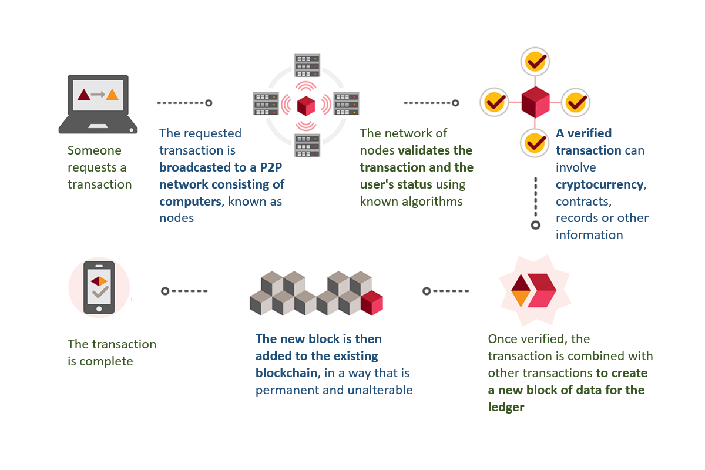

# Proyecto Final

## Descripción

Una criptomoneda basica para probar los conceptos aprendidos de seguridad del curso Seguridad en Computacion. Cada instancia ejecutable es un nodo.

### Funcionalidad

- Hacer Proof of Work para confirmar transacciones.
- Hacer broadcasting de transaccion/bloque a otros nodos.

### Arquitectura

### Referencias

- [Blockchain Based Cloud Computing: Architecture and Research Challenges](https://ieeexplore.ieee.org/document/9252909/)
- [Containerizing Bitcoin and Ethereum with Docker](https://medium.com/mwpartners/containerizing-bitcoin-and-ethereum-with-docker-7c447b484f3a)

## Preguntas

### ¿Por qué escogió esa aplicación?

En el curso de Seguridad en Computacion estamos desarrollando un prototipo de criptomoneda y vimos que era una buena oportunidad para extender ese proyecto.

### ¿Qué características de la computación en nube pueden ser integradas en la aplicación?

- Contenerizacion y orquestramiento de contenedores.

## Resumen de los pasos necesarios para su ejecución

